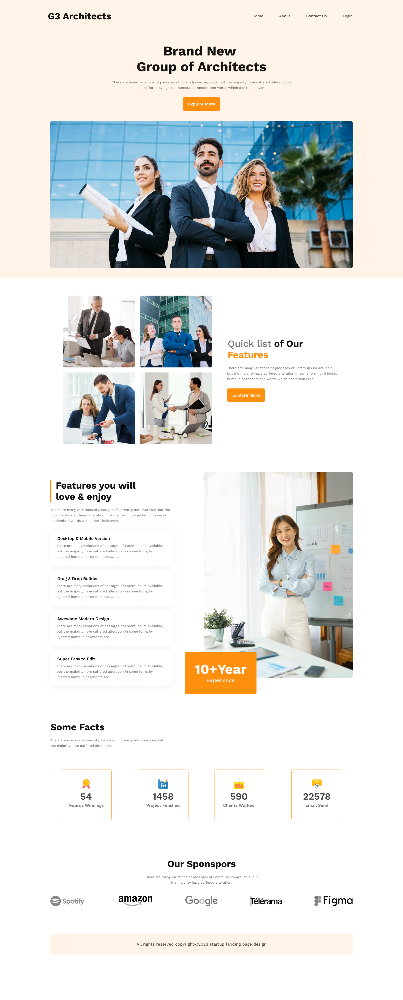

# pghero-assignment2
This project is a clone of the following design. 

## Learning Outcome
1. CSS Grid
2. CSS Flex 
3. Media query
4. How to make a website responsive

## Resource Link
[Click here](https://github.com/ProgrammingHero1/g3-architects)

## Live Website Link
[Click here](https://anik-chy.github.io/pghero-assignment2/)

## Helpful Resources
- [Bootstrap breakpoints](https://getbootstrap.com/docs/5.0/layout/breakpoints/)

- [CSS Flex](https://css-tricks.com/snippets/css/a-guide-to-flexbox/)

- [CSS Units](https://www.w3schools.com/cssref/css_units.php)

- [Button over an image](https://emergestudio.design/how-to-put-a-button-on-top-of-an-image/)

- [Animated Button](https://www.w3schools.com/howto/howto_css_animate_buttons.asp)